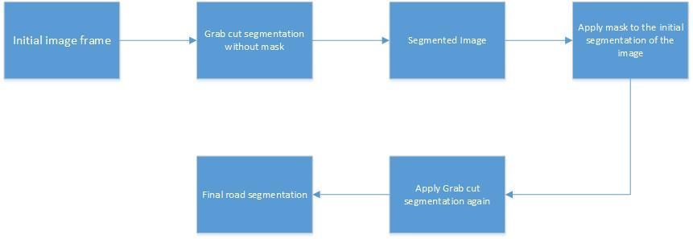
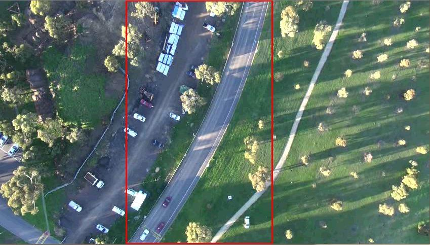
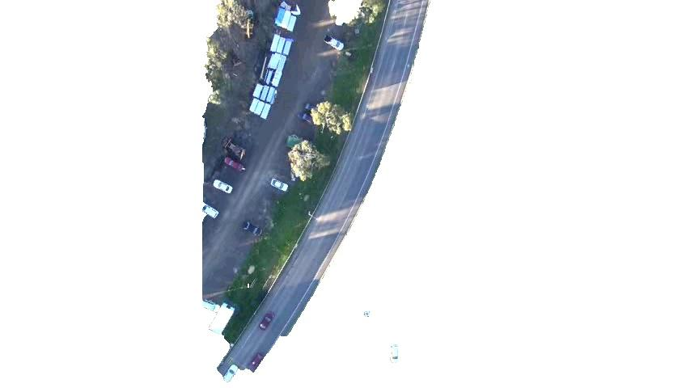
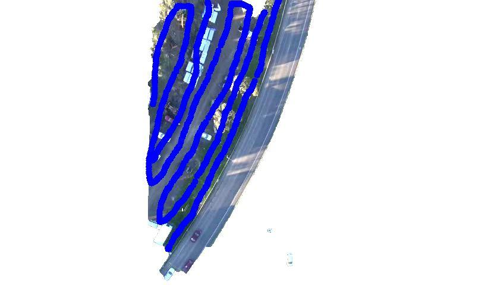
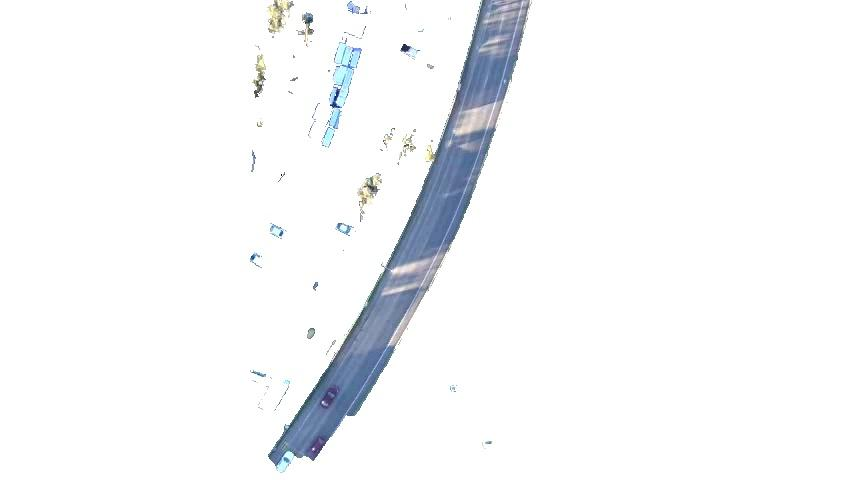
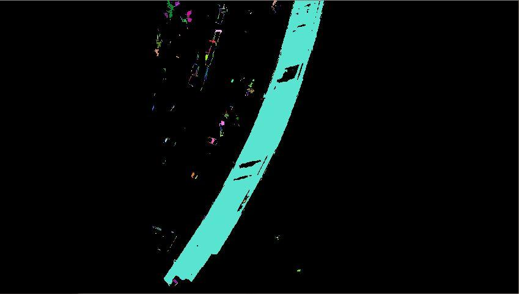
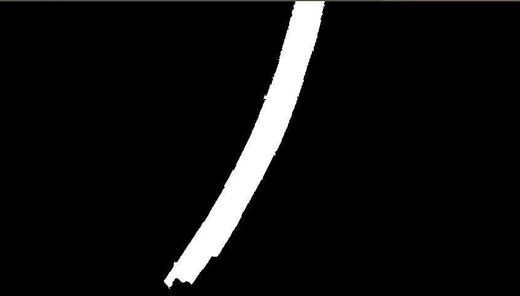
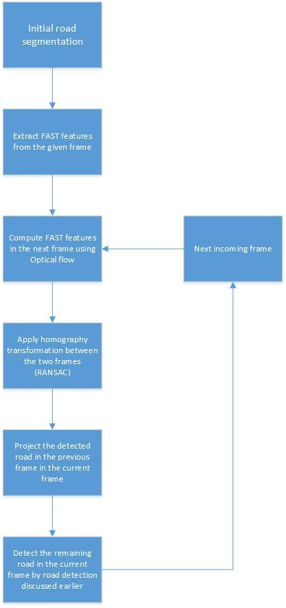
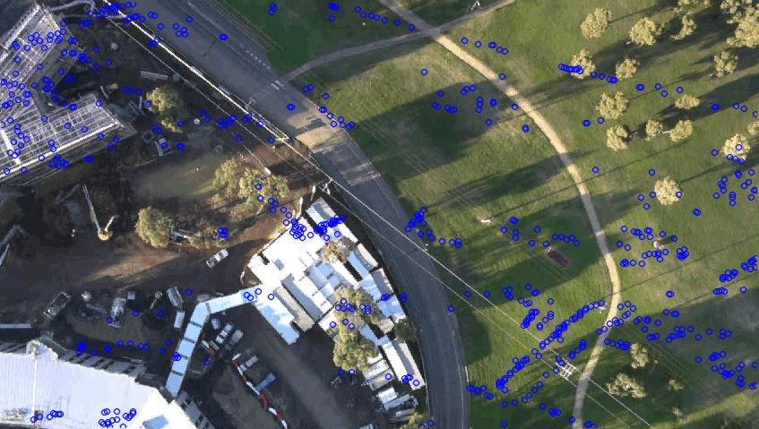
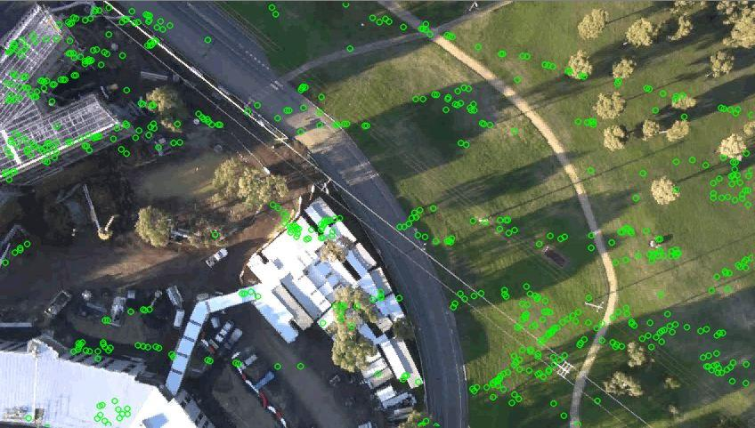

# Road-detection-and-tracking
The project is an implementation of the paper ‘Efficient Road detection and tracking’ by Zhou et al. The algorithm has been implemented in C++ using the OpenCV library setup in CodeBlocks developement environment.

### Prerequisites

For running the project, OpenCV needs to be setup. There are many blogs and resources available for setting up OpenCV either in Windows or Linux OS. I personally prefer Linux as everything is much easier to set up.

## General Methodology

### Road detection Methodology

The algorithmic flow for Road detection can be described as follows:

### Road detection Demo

Step 1: Get an Initial Road segmentation by selecting a ROI. The segmentation method used is the GrabCut segmentation

After selecting the ROI we get an initial segmentation. Note that the segmentation is not proper.

Step 2: Mask some pixels as background to get a proper segmentation

After masking the initial segmentation we get a refined segmentation

Step 4: Apply post processing steps like Connected Component Analysis, Hole filling and Otsu’s Thresholding to get the final image segmentation

### Road tracking methodology

The algorithmic flow for Road detection can be described as follows:

### Road tracking demo:

Step 1: Locate the FAST features in two subsequent frames.Compute the features in one frame and track them in the next frame using Optical Flow or the KL tracker(This is used to compute the Homography matrix between those two frames using the RANSAC method)

Fast features in the present frame

Step 2: Track the roads in the previous frame to the new frame-starting from the final road segmentation-by projecting the detected road pixels in the first frame to the next frame.

Step 3: Detect the new road in the present frame(using skeleton analysis and center of skeleton methodolgies. Implementation in progress!!!).

## Conclusion
Refer to the paper for more details into the algorithm
